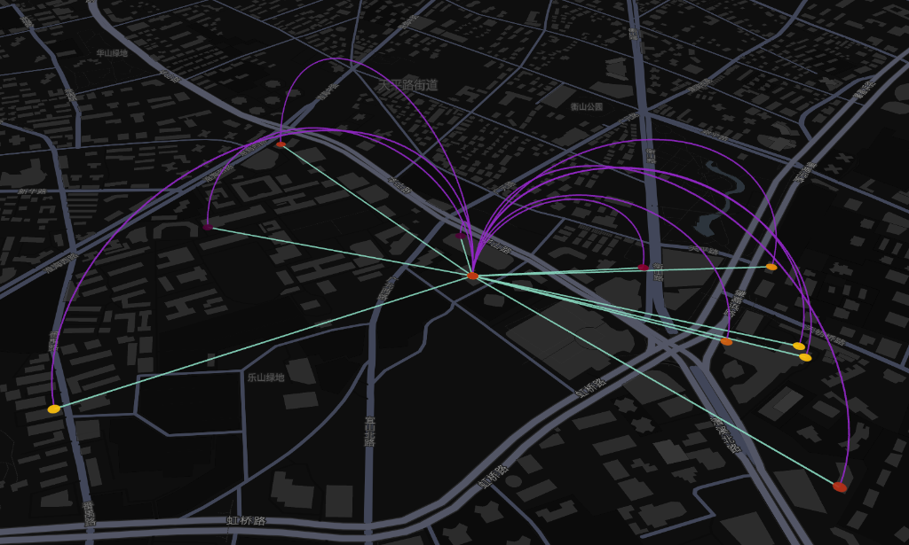

# OpenStreetMap (OSM) 学习与项目计划

本项目旨在通过徐汇区的办公楼与星巴克分布，探索复杂的地理空间分析（GIS）场景，并建立一套完整的开源 GIS 技术栈学习路径。

---

## 📍 当前分析场景：复杂地理分析 (Spatial Analysis)
**案例**：寻找上海徐汇区方圆 1 公里内没有星巴克但有一定写字楼密度的“选址真空区”。

### 🔍 选址真空区分析 (Vacuum Analysis)
针对“写字楼密集但缺乏咖啡配套”的核心需求，我们对徐汇区 157 个办公点进行了 1 公里半径的缓冲区分析。

#### 核心发现：
- **顶级真空点**：经纬度 **(31.11, 121.449)**。该区域位于徐汇南部（靠近华泾/龙吴路周边），小范围内聚集了 **3 个办公点**，但方圆 1 公里内 **0 家星巴克**。
- **次级真空点**：经纬度 **(31.139, 121.449)**。同样存在 2 个办公点处于“咖啡荒漠”状态。

*图1：深紫色点代表方圆1公里内零星巴克覆盖的办公区域。*

---

### 💡 对比分析：高成熟度区域 (Heatmap)
作为对照，我们也分析了徐汇区商业最成熟的区域（如港汇/TWOitc 周边）：
- **配套密度**：该区域 1 公里内星巴克多达 **10 家**。
- **步行距离**：最近的咖啡馆仅需步行 **307 米**。
- **结论**：成熟区域已趋于饱和，新的选址机会主要集中在快速发展的“边缘密集带”。

---

## 🛠 开发者选型建议与业务应用场景

针对不同的项目需求，建议开发者选择最合适的工具栈：

### 1. 简单展示场景 (Simple Display)
*   **选型建议**：Leaflet + MapTiler/Stadia Maps (底图服务商)
*   **优势**：开发成本极低，几行 JS 即可上线，无需维护服务器。

### 2. 复杂地理分析场景 (Spatial Analysis) —— 本项目所属
*   **选型建议**：**PostGIS + Python (GeoPandas) + Overpass API**
*   **典型应用**：商业选址（如本项目）、城市规划研究、房产配套分析。
*   **优势**：强大的 SQL 空间查询，Python 科学计算生态支持。

### 3. 高性能移动端/导航场景 (Mobile & Routing)
*   **选型建议**：MapLibre SDK + Valhalla/OSRM
*   **优势**：矢量切片交互流畅，专业级路径规则引擎。

---

## 🗺 选型决策对照表

| 需求优先级 | 建议方案 | 学习曲线 | 成本 | 代表场景 |
| :--- | :--- | :--- | :--- | :--- |
| **快速上线** | Leaflet + 第三方底图 | 低 | 低 | 官网、活动页 |
| **数据挖掘** | PostGIS + Python | 中 | 中 | 商业选址、科研 |
| **极致交互** | MapLibre + OSRM | 高 | 中 | 导航、外卖、骑行 |
| **大规模/内网** | 自建全套 OSM 服务 | 极高 | 低 | 涉密项目、高频需求 |

---

## 📁 目录结构说明
- `fetch_data.py`: 数据抓取脚本（已升级为抓取 157 个办公点）。
- `generate_kepler_map.py`: 生成基于真空区分析的交互式地图。
- `office_density_vs_starbucks.csv`: 核心分析结果数据集。
- `kepler_vacuum_map.html`: 选址真空图可视化结果。

---

> **建议**：处理业务数据时，建议从 Scenario 2 (PostGIS) 入手，利用 OSM 的开放数据挖掘商业价值。
